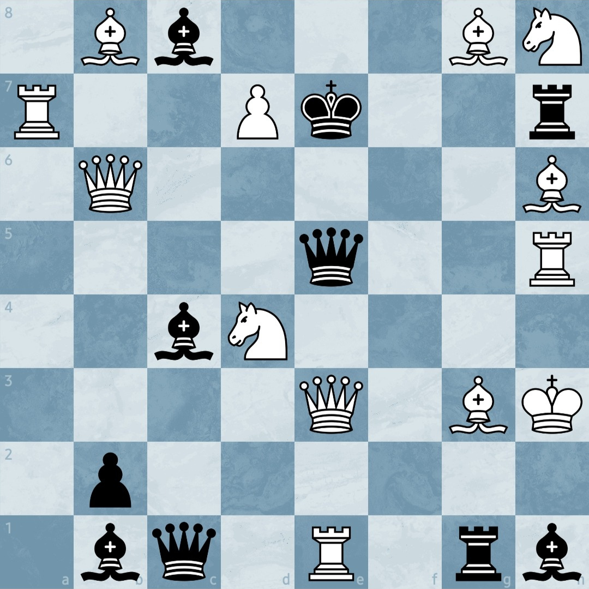

  Sou desenvolvedor, mas desenvolvedor de soluções, trabalhando atualmente no suporte, apaixonado por tecnologia e programação, sempre em busca de soluções inovadoras. Gosto de resolver problemas complexos e explorar ferramentas e frameworks modernos. Além disso, sou entusiasta de xadrez, uma paixão que veio na pandemia e me ajuda a desenvolver pensamento estratégico e habilidades criativas de resolução de problemas.

  Aqui você encontrará meus projetos de desenvolvimento, nos quais busco sempre combinar lógica com criatividade. Sou um cara aberto a dicas e aperfeiçoamentos, então se quiser falar sobre algum repositório ou assunto de aprendizado, pode me chamar em uma das redes sociais abaixo.

  
  

ㅤ

  <h2>Minhas Skills</h2> 

  
  
  
   
  
  
  
  
  

ㅤ

  <h2>Estudando de momento</h2> 

  
  

ㅤ

  Se caso você gosta do mundo enxadrístico tanto quanto eu, para aquecer a sua mente, tente achar o lance de mate em um, jogado pelas brancas.

  

  Se caso não achou, saiba que o lance seria De3 em a3.

